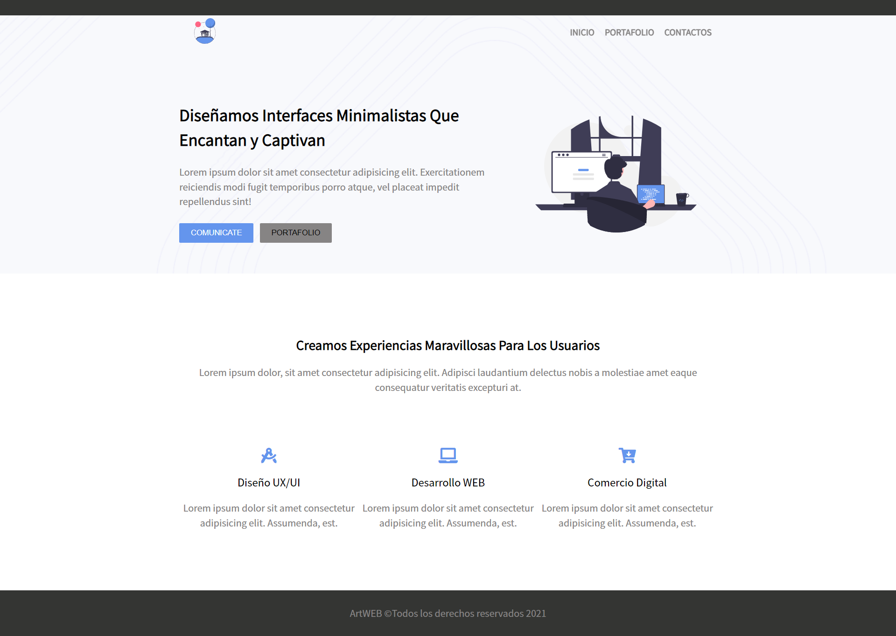

# PRIMER SITIO WEB CON SASS

En esta pagina web responsive con SASS. Fue echa del tutorial de Emprinnos, donde enseña como usar parciales, variables en Sass, mixins, extend, al igual que el concepto de "nesting".

- Ver Pagina: [Link](https://sergio-ivan-melgarejo.github.io/sass-landing-page/)

## Tutorial de SASS de Emprinnos

Los invito a ver el tutorial sobre cómo [Estilizamos una Pagina Web Responsive con SASS](https://www.youtube.com/watch?v=4lb_IC9nmA0) en el canal de Youtube.